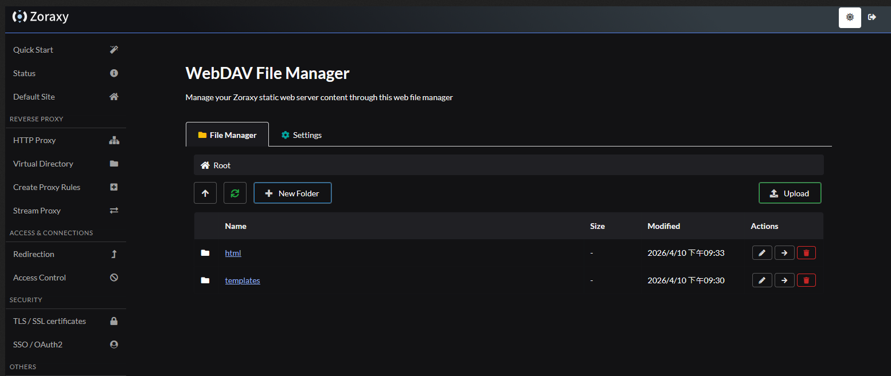
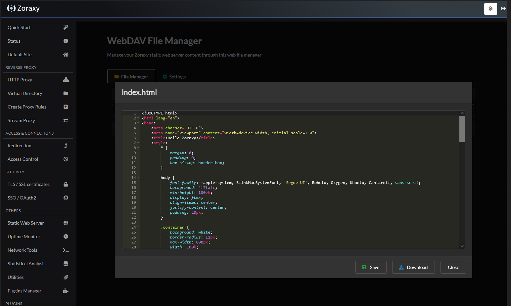
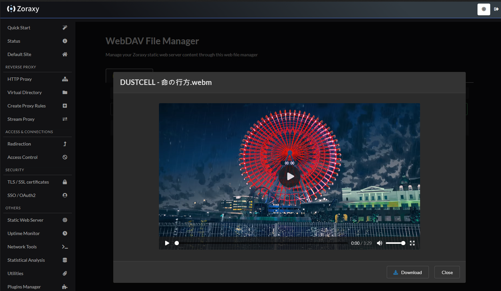

# WebDAV File Manager

A Zoraxy plugin that provides a web-based file manager for accessing the Zoraxy Static Web Server via its WebDAV interface. Browse, upload, edit, and manage files directly from your browser.

## Features

- **File Browsing** – Navigate directories with breadcrumb navigation
- **Upload** – Upload files via button or drag & drop, with progress indicator
- **Download** – Download any file directly from the browser
- **Text Editing** – Edit text-based files (HTML, CSS, JS, JSON, Markdown, Go, Python, etc.) with the Ace code editor (dark theme, syntax highlighting, Ctrl+S save)
- **Media Preview** – Preview images, play audio, and play video files in the browser
- **File Operations** – Rename, move, and delete files and folders
- **Create Folders** – Create new directories from the UI
- **Settings Panel** – Configure WebDAV connection (port, username, password, max upload size)
- **Dark Theme** – Follows Zoraxy's dark theme when enabled

## Screenshots








## Configuration

On first launch the plugin creates a `config.json` with default values:

| Setting | Default | Description |
|---------|---------|-------------|
| Port | `5488` | WebDAV server port to connect to |
| Username | *(empty)* | WebDAV Basic Auth username |
| Password | *(empty)* | WebDAV Basic Auth password |
| Max Upload Size | `25 MB` | Maximum upload file size |

The file manager will prompt you to configure credentials on the **Settings** tab before it can be used.

## Building

```bash
cd src/plugins/webdav-file-manager
go build
```

## API Endpoints

| Method | Endpoint | Description |
|--------|----------|-------------|
| GET | `/api/getConfigs` | Get current configuration |
| POST | `/api/setConfigs` | Update configuration |
| GET | `/api/file/list` | List files in a directory |
| GET | `/api/file/open` | Get file content (text) or metadata (binary) |
| GET | `/api/file/download` | Download a file |
| POST | `/api/file/upload` | Upload a file (multipart form) |
| POST | `/api/file/save` | Save text file content |
| POST | `/api/file/delete` | Delete a file or folder |
| POST | `/api/file/rename` | Rename a file or folder |
| POST | `/api/file/move` | Move a file to another directory |
| POST | `/api/file/cut` | Alias for move |
| POST | `/api/file/newFolder` | Create a new folder |

## License

MIT License
